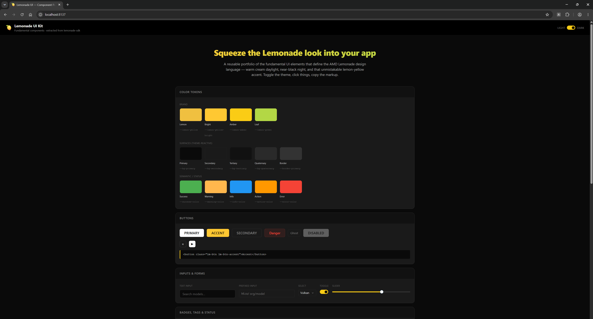

# Lemonade Styling Kit

A reusable styling reference for the **AMD Lemonade** look & feel, distilled from
[lemonade-sdk/lemonade](https://github.com/lemonade-sdk/lemonade). Drop it into a Lemonade
extension or companion app and get a UI that matches the official desktop app — light and dark.



## What's inside

| Path | Purpose |
|------|---------|
| **`AGENTS.md`** | The styling contract — start here (esp. if you're an AI agent). |
| `docs/STYLE_GUIDE.md` | The design language: philosophy, color, type, spacing, motion. |
| `docs/COMPONENTS.md` | Per-component class & markup reference. |
| `portfolio/` | A live gallery of every component (`index.html`). |
| `portfolio/css/tokens.css` | **Reusable** — design tokens (light + dark). |
| `portfolio/css/components.css` | **Reusable** — the `.lm-*` component library. |

## Use it

```html
<html data-theme="dark">
  <link rel="stylesheet" href="portfolio/css/tokens.css" />
  <link rel="stylesheet" href="portfolio/css/components.css" />
  ...
  <button class="lm-btn lm-btn-accent">Run model</button>
</html>
```

Only `tokens.css` + `components.css` are meant to ship into a real project. Everything else is
documentation and demo scaffolding.

## Preview the gallery

```bash
cd portfolio
python -m http.server 8137
# open http://localhost:8137
```

Toggle light/dark with the switch in the top bar.

## The rules in one line

Never hardcode a color — use `var(--token)`. Reuse `.lm-*` components. Dark is default. Yellow is
a seasoning. See `AGENTS.md` for the rest.
